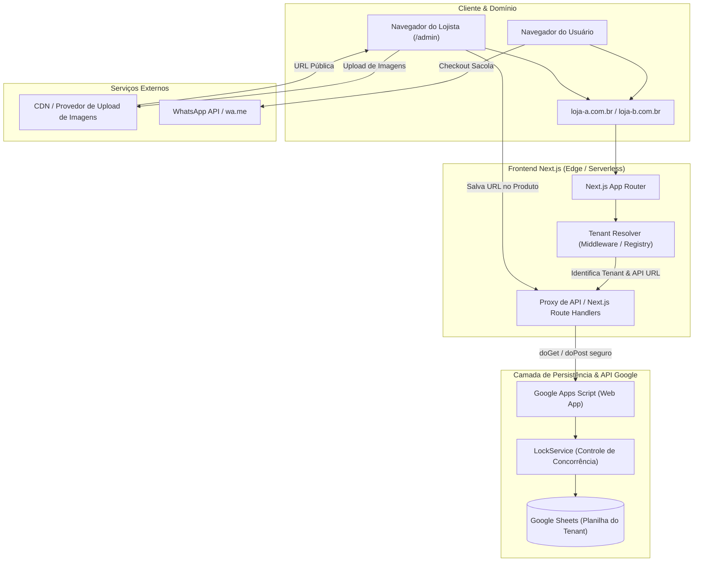

# Arquitetura Técnica — SaaS Catálogo Digital Multi-Tenant

## 1. Visão Geral do Produto

O sistema é uma plataforma white-label multi-tenant projetada para atender empresas locais com baixo custo de infraestrutura, alta confiabilidade e extrema simplicidade operacional. 

O produto viabiliza para cada cliente:
- Uma vitrine de catálogo rápida e responsiva (mobile-first);
- Domínio próprio ou subdomínio personalizado;
- Painel administrativo (`/admin`) para gestão de catálogo, produtos, variações e identidade visual;
- Sacola de compras persistente no cliente;
- Fechamento de pedidos diretamente no WhatsApp da loja via link estruturado (`wa.me`);
- Armazenamento de dados no Google Sheets orquestrado por uma API executada no Google Apps Script;
- Hospedagem externa de imagens em provedores de mídia (ex.: Cloudinary, ImgBB, Supabase Storage, S3);
- Operação **sem gateway de pagamento**, transferindo o fechamento e a negociação para o canal direto da empresa local.

---

## 2. Diagrama da Arquitetura

---

## 3. Frontend Multi-Tenant (Next.js)

- **Stack**: Next.js (App Router), React, TypeScript estrito, Tailwind CSS, Lucide Icons.
- **Isolamento de Estilos e Tema**:
  - CSS Custom Properties injetadas na inicialização com base no tenant:
    - `--primary-color`
    - `--secondary-color`
  - Renderização fluida e consistente em qualquer dispositivo (320px até 1440px+).
- **Consumo de Dados Desacoplado**:
  - Os componentes de UI jamais conhecem Google Sheets ou a estrutura interna das planilhas.
  - Uma camada abstrata (`src/lib/api.ts`) consome o contrato de API unificado.
  - Para evitar bloqueios de CORS e preflight `OPTIONS` típicos do Google Apps Script ao rodar chamadas diretas no browser, as chamadas podem ser intermediadas com facilidade através dos Route Handlers do Next.js ou feitas via simples POST com `text/plain` suportado nativamente pelo GAS.

---

## 4. Backend (Google Apps Script Web App)

- **Tecnologia**: Google Apps Script publicado como Web App com acesso `Qualquer pessoa (mesmo anônima)`.
- **Roteamento HTTP**:
  - `doGet(e)`: trata requisições de leitura pública (`?action=store`, `?action=categories`, `?action=products`, `?action=all`).
  - `doPost(e)`: trata ações autenticadas ou com payload (`login`, `createProduct`, `updateProduct`, `deleteProduct`, `saveConfig`).
- **Respostas Padronizadas**:
  - Todas as respostas são retornadas em JSON via `ContentService.createTextOutput(JSON.stringify(...)).setMimeType(ContentService.MimeType.JSON)`.
  - Estrutura de sucesso: `{"success": true, "data": ..., "error": null}`
  - Estrutura de erro: `{"success": false, "data": null, "error": {"code": "...", "message": "..."}}`
- **Gestão de Concorrência**:
  - Todo comando de escrita (`doPost`) invoca `LockService.getScriptLock()` com tempo limite de 30 segundos (`lock.tryLock(30000)`).
  - O lock é obrigatoriamente liberado no bloco `finally`.
- **Limitações do Google Apps Script & Soluções Técnicas**:
  1. *Redirecionamento 302*: Chamadas públicas da Web App sofrem redirect automático da Google. O cliente HTTP precisa seguir redirecionamentos (`fetch` nativo no Node.js e no browser faz isso transparentemente quando não há preflight bloqueado).
  2. *Ausência de suporte a OPTIONS / Preflight CORS*: O Google Apps Script não implementa resposta ao método HTTP OPTIONS. Requisições feitas pelo frontend via POST com headers customizados causam falha de CORS. Solução: o backend Apps Script aceita payloads em `text/plain` contendo a string JSON ou chamadas roteadas pelo backend do Next.js.
  3. *Tempo de execução*: Execução máxima de 6 minutos por chamada. O modelo de dados em planilha de catálogo opera em centenas de milissegundos, muito abaixo do teto.

---

## 5. Banco de Dados (Google Sheets)

Cada loja possui sua própria planilha dedicada, estruturada em três abas essenciais:

1. **`config`**:
   - Formato Chave-Valor (`chave | valor`).
   - Configurações da loja: nome, logo, cores primária e secundária, WhatsApp, domínio, moeda, fuso horário, hash de senha de administrador e token de API.
2. **`categorias`**:
   - `id | nome | slug | ativo | ordem | createdAt | updatedAt`
3. **`produtos`**:
   - `id | categoriaId | nome | slug | descricao | preco | precoPromocional | imagens | variacoes | estoque | ativo | createdAt | updatedAt | deletedAt`
   - **Soft Delete**: produtos desativados ou excluídos preenchem `deletedAt` com timestamp ISO e `ativo = false`, mantendo rastreabilidade e integridade referencial.
   - **Serialização de Variações**: campo `variacoes` armazena array JSON de especificações (ex.: tamanho, cor).
   - **Imagens**: lista de URLs públicas armazenadas em formato JSON ou string delimitada.

---

## 6. Multi-Tenancy & Resolução de Domínios

- **Modelo**: Aplicação única compartilhada (Single Codebase Multi-Tenant) apontando para planilhas isoladas por tenant.
- **Tenant Registry**:
  - Registro determinístico que mapeia `hostname` para `{ tenantId, apiUrl }`.
  - Fontes de resolução:
    1. Arquivo de configuração centralizado (`tenants.json`).
    2. Futura expansão para Cloudflare KV, Edge Config ou banco serverless.
- **Normalização de Hostname**:
  - Remoção de porta (ex.: `:3000`), remoção do prefixo `www.` e conversão para minúsculas.
  - Suporte ao ambiente `localhost` via variável `NEXT_PUBLIC_DEFAULT_TENANT` ou parâmetro de cabeçalho de desenvolvimento.
- **Segurança de Tenant**:
  - O cliente web não tem autorização para injetar `apiUrl` arbitrária.
  - Somente domínios cadastrados no registro de tenants são resolvidos. Domínios não cadastrados recebem tela de 404 (Tenant Not Found).

---

## 7. Autenticação & Autorização

- **Painel Administrativo**:
  - Login via formulário com senha.
  - Senhas são submetidas à verificação de hash criptográfico no servidor Apps Script.
  - **Nenhuma senha em texto puro é gravada** na planilha. O hash é gerado com SHA-256 (com salt definido pelo store_id ou salt dinâmico seguro).
  - Em caso de sucesso, o Apps Script retorna uma sessão autenticada com token de acesso temporário ou validação de token administrativo.
- **Proteção de Dados Sensíveis**:
  - O `admin_password_hash` e o `api_token` **nunca são expostos** em nenhuma rota pública (`?action=store`, `?action=all`).
  - O backend do Apps Script filtra os dados de configuração antes de enviá-los ao chamador público.

---

## 8. Upload e Armazenamento de Imagens

- A planilha não armazena arquivos binários (imagens).
- Imagens são enviadas pelo navegador diretamente para um provedor de hospedagem de mídia externo confiável (Cloudinary com unsigned preset, ImgBB, S3 com presigned URL ou Supabase Storage).
- Apenas a URL HTTPS pública retornada pelo provedor é enviada à API do Google Apps Script para ser vinculada ao produto ou à identidade visual da loja.

---

## 9. Checkout & Integração WhatsApp

- **Sem Gateway de Pagamento**: Elimina custos de transação, burocracia de antifraude e complexidade de conciliação financeira para comércios locais.
- **Motor de WhatsApp (`src/lib/whatsapp.ts`)**:
  - Biblioteca pura e desacoplada do React.
  - Formatação precisa dos itens da sacola, variações selecionadas, quantidades, preços e total.
  - Utilização de markdown nativo do WhatsApp (`*negrito*`, `_itálico_`).
  - Higienização e sanitização de dados:
    - Normalização estrita do telefone (remoção de `+`, `(`, `)`, `-` e espaços em branco).
    - Aplicação mandatória de `encodeURIComponent` na mensagem.
    - Saída gerada: `https://wa.me/{numero_sanitizado}?text={mensagem_codificada}`.

---

## 10. DNS & Estratégia de Hospedagem

- **Frontend**: Hospedado na Vercel ou Cloudflare Pages com borda global (Edge Network).
- **Configuração de Domínio Personalizado**:
  - Registro de domínios customizados (ex.: Registro.br, GoDaddy, Cloudflare).
  - Subdomínio: apontamento de registro `CNAME` para o host de borda (ex.: `cname.vercel-dns.com`).
  - Domínio raiz (Apex/Apex Domain): apontamento `A` ou `ANAME/ALIAS` para o IP do provedor Edge.
  - HTTPS provisionado automaticamente com certificados SSL/TLS gratuitos gerenciados pela plataforma de frontend.
  - **Importante**: Domínios de clientes **nunca** apontam diretamente para URLs do Google Apps Script. O tráfego sempre flui pelo frontend Next.js.

---

## 11. Segurança

- **Princípio do Menor Privilégio**: O frontend público acessa somente leitura filtrada.
- **Prevenção de XSS e Injeção**:
  - Sanitização de inputs no client (Zod) e no backend Apps Script antes de gravação.
- **Proteção contra Adulteração**:
  - `store_id` e `api_token` não podem ser alterados via endpoints públicos nem via `saveConfig`.
  - IDs de produtos e categorias são UUIDs gerados no backend, evitando previsibilidade ou sobrescrita maliciosa.
- **Lock Concorrente**:
  - Proteção contra condições de corrida durante atualizações simultâneas no Google Sheets via `LockService`.

---

## 12. Estratégia de Testes

- **Testes Unitários**:
  - Motor de WhatsApp (formatação de moeda, variações, totais, sanitização de telefone, caracteres especiais).
  - Resolvers de tenant e normalização de domínios.
  - Validações de esquema Zod para formulários e modelos.
- **Testes de Integração**:
  - Emulador / Mock do backend Google Apps Script: validação do comportamento de CRUD, soft delete, autenticação e formato das respostas JSON.
  - Contratos de API: verificação de que todas as respostas obedecem rigorosamente à tipagem TypeScript definida.
- **Testes E2E**:
  - Fluxo completo do catálogo: visualização de produtos -> seleção de variação -> adição à sacola -> redirecionamento formatado para WhatsApp.
  - Fluxo do admin: login -> criação de categoria/produto -> edição -> soft delete.

---

## 13. Estratégia de Escalabilidade & Migração Futura

- O uso de Google Sheets oferece custo zero de banco de dados e manutenção extremamente simples para pequenos comerciantes locais.
- A arquitetura foi concebida com desacoplamento absoluto:
  - Todo o acesso à camada de dados é mediado por contratos REST estritos (`API_CONTRACT.md`).
  - Caso um tenant cresça em volume de produtos ou acessos que justifiquem migração para PostgreSQL, Supabase ou SQLite/Turso, basta substituir o adaptador de backend no Tenant Registry sem alterar uma única linha dos componentes de interface do catálogo ou do painel administrativo.
