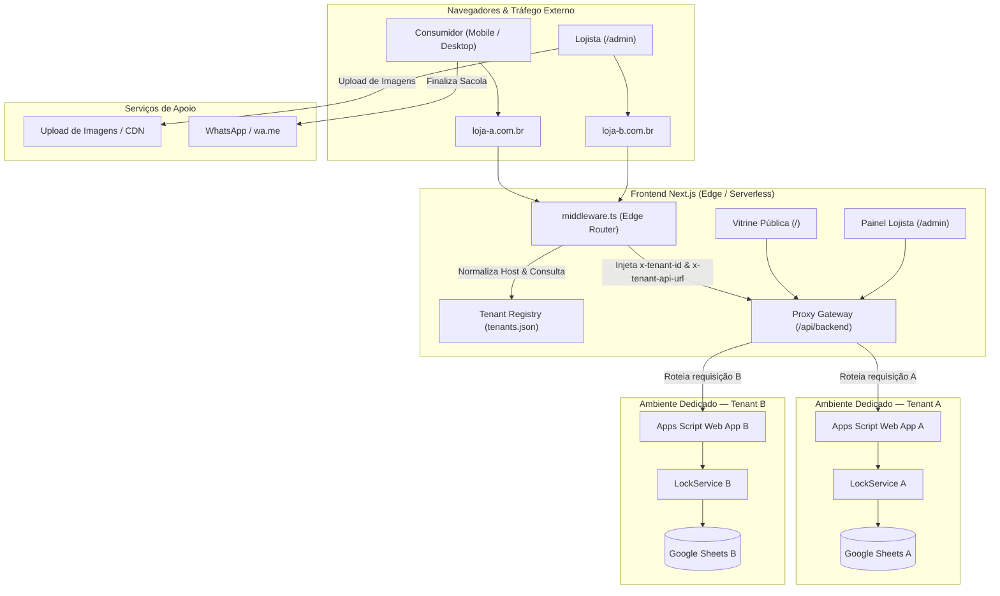

# Arquitetura Integrada do Sistema — SaaS Catálogo Digital Multi-Tenant (v1.2.0)

Este documento descreve a arquitetura consolidada e a integração de todos os subsistemas da plataforma: **Backend Google Apps Script**, **Painel Administrativo**, **Vitrine Pública**, **Motor de WhatsApp** e **Roteamento Multi-Tenant na Borda**.

---

## 1. Topologia e Visão Geral

A plataforma opera sob um modelo híbrido Serverless / Edge:
- **Frontend & Roteador Edge**: Uma única aplicação Next.js (App Router) atende múltiplos clientes.
- **Isolamento Multi-Tenant**: Cada cliente possui seu domínio próprio (ou subdomínio) e sua própria planilha no Google Sheets com Web App dedicada no Google Apps Script.
- **Sem Gateway de Pagamento**: Pedidos são gerados no cliente, estruturados e despachados diretamente para o WhatsApp oficial da loja (`wa.me`).
- **Mídia Desacoplada**: Imagens são hospedadas em provedor externo com CDN (ex.: Cloudinary), armazenando apenas a URL HTTPS pública na planilha.

---

## 2. Subsistemas Integrados

### 2.1 Resolução Multi-Tenant e Roteamento de Borda (`src/middleware.ts` & `src/lib/tenantResolver.ts`)
- **Normalização de Hostname**: Remove portas locais (`:3000`), elimina prefixo canônico `www.` e converte para letras minúsculas.
- **Consulta Estrita**: O hostname normalizado é buscado em `tenants.json`.
- **Prevenção de Spoofing**: Requisições de domínios desconhecidos ou maliciosos são imediatamente direcionadas para a página amigável `/tenant-not-found` com código 404, impossibilitando injeção de parâmetros arbitrários de API.
- **Injeção Segura**: Cabeçalhos `x-tenant-id` e `x-tenant-api-url` são repassados internamente ao Next.js Route Handler.

### 2.2 Gateway Proxy Serverless (`src/app/api/backend/route.ts`)
- Atua como ponte entre o navegador e o Google Apps Script.
- **Benefícios**:
  - Elimina erros de preflight CORS (`OPTIONS`) no navegador;
  - Segue automaticamente os redirecionamentos HTTP 302 gerados pela infraestrutura do Google Apps Script;
  - Protege URLs de infraestrutura contra manipulação do usuário final;
  - Em desenvolvimento local ou suítes de teste, despacha chamadas para instâncias isoladas em memória do `BackendEngine`.

### 2.3 Backend Apps Script & Google Sheets (`backend/Code.gs` & `src/backend/engine.ts`)
- **Arquitetura de Abas**:
  - `config`: Propriedades da loja, identidade visual, fuso horário, moedas e chaves seguras (imutáveis via API).
  - `categorias`: Classificação hierárquica com `slug`, `ordem` e `ativo`.
  - `produtos`: Itens com suporte a JSON tipado de variações (`VariationOption[]`), estoque numérico, array de imagens e soft delete (`deletedAt`).
- **Concorrência Atômica**: `LockService.getScriptLock().tryLock(30000)` envolve todas as operações de mutação (`doPost`), prevenindo condições de corrida na planilha.
- **Privacidade de Segredos**: Hashes de senha e tokens nunca são expostos em endpoints de leitura pública (`GET store` / `GET all`).

### 2.4 Vitrine Pública (`src/app/page.tsx`, `ProductCard`, `ProductModal`, `CartDrawer`)
- **Mobile-First & Acessível**: Responsividade completa, drawer lateral suave, suporte a teclado (`ESC`) e bloqueio de scroll.
- **Tema Dinâmico**: Variáveis CSS `--primary-color` e `--secondary-color` aplicadas dinamicamente com base nas cores configuradas pelo lojista.
- **Sacola Persistente**: Gerenciada por `CartProvider` e sincronizada no `localStorage`.
- **Seleção Rigorosa de Variações**: O modal de detalhes valida que o consumidor selecione todas as opções de variação antes de permitir a adição à sacola.

### 2.5 Motor de WhatsApp (`src/lib/whatsapp.ts`)
- Biblioteca pura em TypeScript (sem acoplamento com React ou DOM).
- **Cálculo Determinístico**: Subtotais e total geral arredondados rigorosamente com precisão monetária de 2 casas decimais.
- **Suporte a Promoções**: Exibe preço promocional ativo com o preço regular tachado (`~R$ 100,00~ por R$ 80,00`).
- **Encoding Wa.me**: Aplicação obrigatória de `encodeURIComponent()` para garantir links 100% seguros contra corrupção de caracteres especiais ou quebras de linha.

### 2.6 Painel Administrativo (`/admin`)
- Módulos completos: Login com SHA-256 + salt, Dashboard, Gestão de Produtos com Variation Builder interativo, Categorias e Configurações da Loja.
- Upload de imagens integrado com visualização prévia e fallbacks.

---

## 3. Matriz de Contratos e Fluxos de Dados

| Fluxo | Origem | Destino | Formato de Dados | Garantias |
| :--- | :--- | :--- | :--- | :--- |
| **Inicialização Vitrine** | `src/app/page.tsx` | `/api/backend?action=all` | JSON `APIResponse<CatalogInitialData>` | Leitura rápida em requisição única consolidada |
| **Login Lojista** | `/admin/login` | `/api/backend` (`action: login`) | JSON `{ password: string }` | Senha nunca trafega em texto puro na persistência; SHA-256 |
| **Mutação Admin** | `/admin/*` | `/api/backend` | JSON com `token` | Bloqueio via `LockService`, validação Zod e integridade referencial |
| **Checkout WhatsApp** | `CartDrawer.tsx` | `wa.me/{phone}?text={encoded}` | URL codificada | Subtotal exato, telefone sanitizado e texto legível com emojis |

---

## 4. Evolução para Alta Escala

À medida que o volume de clientes e acessos crescer:
1. **Edge KV para Mapeamento de Domínios**: Migração de `tenants.json` para Vercel Edge Config ou Cloudflare Workers KV, permitindo provisionar novos lojistas em sub-milissegundos sem novo deploy da aplicação.
2. **Cache Stale-While-Revalidate (SWR) na Borda**: Cache de leitura do catálogo público por 60 segundos com invalidação instantânea sob demanda via webhook quando o lojista salva alterações no `/admin`.
